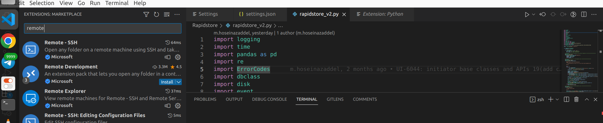

```
ssh://root@172.20.12.19:2242/usr/bin/python -u /root/.pycharm_helpers/pydev/pydevd.py --multiprocess --qt-support=auto --client 127.0.0.1 --port 59193 --file /etc/SAB-UI/server.py --port 8001
```
<div dir="rtl">
نحوه ران در vscode
  
اکستنشن remote ssh و remote explorer رو نصب کنید



  
  برای نصب vscode-server   طبق 
  https://stackoverflow.com/questions/56718453/using-remote-ssh-in-vscode-on-a-target-machine-that-only-allows-inbound-ssh-co 
  
  جلو برین
  
  از مسیر  ~/.vscode/extensions. 
اکستنشنای مورد نیازو tarکنین 
  
  
  و به مسیر اکستنشنا در سروز ببری
  
  
  بعد از untar کردن فایلا
  گوشه سمت چپ پایین کلیک کنید و connect to host
  
  
  
  add new ssh host
  
  ssh root@172....
  
  
  
  این مرحله انتخابی است
  
  
  حال دوباره روی دکمه قبلی کلیک کنید
  
  connect to host
  
  حالا سرور نشان داده شده
  
  
  یا از طریق زیر
  
  
  
  به مسیر پروژه برین
  حال باید interprter رو تغییر بدین
  ختما extensionهای ms-pythonرا به روش گقته شده اد کرده باشید
  f1 رو بزنید
  
   
  
  مسیر interpreter رو مشخص کنید و با ارور زیر روبرو شویذ
  
  
  
  https://learn.microsoft.com/en-us/answers/questions/724858/vscode-debugger-not-working-for-python.html
  
  https://github.com/microsoft/vscode-python/releases/tag/2021.12.1559732655
  visx رو دانلود کنید
  
  و code --install-extension myextension.vsix
  و یا لوکال
  
  
  2021.12.1559732655
  
  این ورژن رو نصب کنین

و دوباره tar کنین و ...

حالا روی سرور git clone ssh://git@git.hpds.ir:22/root/UI.git
و یا
  
کافیه جای پروژه رو روی سرور و لوکال با sshfs مانت کنین
  
تنظیمات پایتون و پورت فرواردینگش رو در قایل launch.json تنظیم کنید 
  
  

  
for more:
https://code.visualstudio.com/docs/python/debugging#_remote-script-debugging-with-ssh
  
</div>
